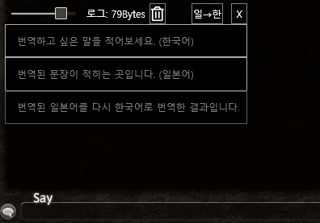

# Amaurot Translator
Lightweight &amp; Japanese-Korean translator for FFXIV

  
한→일 번역  

  
일→한 번역  

  
투명도 조절  

  
번역결과가 클립보드에 자동으로 저장됩니다.  
채팅창에 Ctrl+V를 눌러 번역 결과를 바로 붙여넣을 수 있습니다.  

## 권장 실행환경  
- Windows 10 64bit
- Windows 11 64bit

## 요구 환경
- .NET 6 [[다운로드](https://dotnet.microsoft.com/en-us/download/dotnet/thank-you/runtime-desktop-6.0.8-windows-x64-installer)]

오류 제보, 기능 추가 문의는 [[Issues](https://github.com/sappho192/AmaurotTranslator/issues)] 혹은 [[Discord](https://discord.gg/HJ8Y2sMjfu)]로 문의바랍니다.

## 다운로드
최신 버전(2.0.2): [[다운로드](https://github.com/sappho192/AmaurotTranslator/releases/download/2.0.2/AmourotTranslator.v2.0.2.zip)] 
