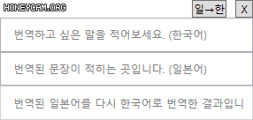
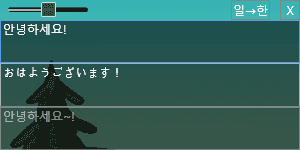

# Amaurot-Translator
Lightweight &amp; Japanese-Korean translator for FFXIV

   

## 권장 실행환경  
Windows 10 64bit

## 요구 환경
.NET 5 [[다운로드](https://dotnet.microsoft.com/download/dotnet/thank-you/runtime-desktop-5.0.10-windows-x64-installer)]

오류 제보, 기능 추가 문의는 [[Issues](https://github.com/sappho192/AmaurotTranslator/issues)] 혹은 [[Discord](https://discord.gg/HJ8Y2sMjfu)]로 문의바랍니다.

## 다운로드
최신 버전(1.0.0): [[다운로드](https://github.com/sappho192/AmaurotTranslator/releases/download/1.0.0/AmourotTranslator.v1.0.0.zip)] 
